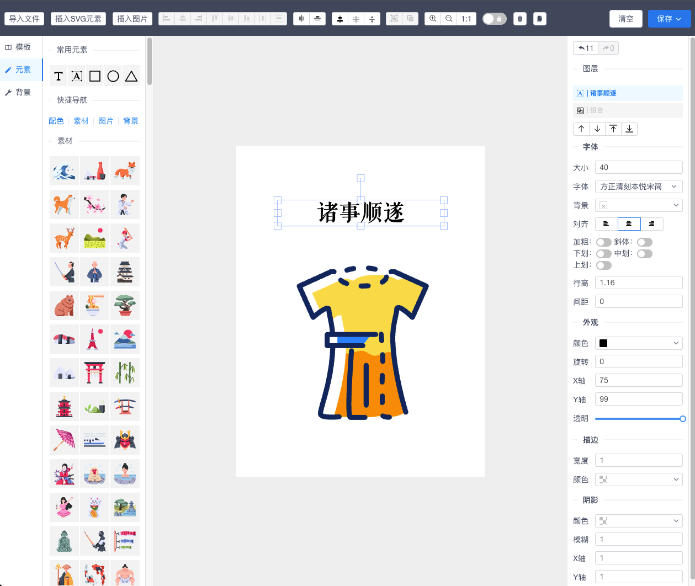

# vue-fabric-editor
[Demo](https://nihaojob.github.io/vue-fabric-editor/) 基于fabric.js和Vue的图片编辑器，可自定义字体、素材、设计模板。

<p align="center"></p>

## 已有功能
- 导入JSON文件
- 保存为PNG、SVG、JSON文件
- 插入SVG、图片文件
- 多元素水平、垂直对齐方式
- 组合/拆分组合
- 图层及顺序调整
- 撤销/重做
- 背景属性设置
- 外观属性/字体属性/描边/阴影
- 自定义字体
- 自定义模板素材

## 使用
### 启动项目
```
yarn install
yarn serve
```

### 自定义字体
字体相关的文件在`src/assets/fonts`中，将字体文件放目录下，并将新添加的字体名称更新到`font.css`和`font.js`文件中。
```js
// font.js
const cnList = [
    {
        "name": "汉体",
        "fontFamily": "汉体"
    },
    {
        "name": "华康金刚黑",
        "fontFamily": "华康金刚黑"
    }
]

const enList = []
export default [...cnList, ...enList]
```

```css
/* font.css */
@font-face{
    font-family: '汉体';
    src : url('./cn/汉体.ttf');
}

@font-face{
    font-family: '华康金刚黑';
    src : url('./cn/华康金刚黑.ttf');
}
```
### 自定义模板
自定义模板的入口在`src/components/importTmpl.vue`组件中，可将模板图片与JSON文件放在`public/template`文件中，将数据拼在组件中即可展示。


## 贡献指南
这是一个自己在使用的设计编辑器项目，市场上有很多类似的收费的编辑器，作为一个开发人员，还是希望能够找到可便捷的扩展、定制的编辑器，如果你也有需求，欢迎一起来维护。
微信：13146890191

开发介绍：[使用fabric.js 快速开发一个图片编辑器](https://juejin.cn/post/7155040639497797645)

## 规划


### 可能新增功能
- [ ] svgIcon汇总
- [ ] 标题样式列表模板
- [ ] 渐变配置
- [x] 复制 粘贴 快捷键
- [ ] 拖动模式，放大缩小
- [ ] 画布大小保存
- [ ] 替换图片、加载url图片
- [x] 缩放
- [ ] 三角形、箭头、线条
- [ ] 平铺背景、等比例背景
- [ ] 预览
- [ ] 描边 strokeDashArray
- [ ] 绘制线条
- [ ] 绘制图形

## License
Licensed under the MIT License.